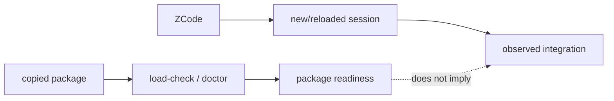

# Package delivery

This page explains the deployment boundary in code terms. A plugin package contains files a host may load; it does not contain the host's marketplace registry, session state, or connector process table.

## Published v1.3.1 route and host readiness

LazyZCode v1.3.1 ships as a native ZCode plugin: `plugins/lazyzcode/` carries
`.zcode-plugin/plugin.json`, and the marketplace root `plugins/marketplace.json`
lists it. v1.3.1 is the published stable release. The supported route IDs are `zcode-marketplace` (the full-plugin
route) and `manual-skills-mcp-fallback` (recovery only, mutually exclusive
with a full-plugin route in the same project). v2 records native mode as
`invoke-documented`, `observe-only`, `descriptor-only`, or `unavailable`;
public label as `documented-tested`, `documented-untested`,
`observed-build-specific`, or `unavailable`; and evidence scope as `package`,
`probe`, or `current-session`. Package readiness does not prove a live host.

Automatic workflow selection uses task risk and complexity to select the
smallest sufficient existing workflow. Before a fresh host observation, this is
only a selection record; it does not prove a workflow loaded or dispatched.

## Durable lifecycle

Prerequisites are **Node.js LTS 24 (recommended) or 22 (supported alternative)**
and **Git**; the lifecycle also accepts Node.js LTS 20 for compatibility (the
lifecycle CLI
and the plugin's MCP launchers are local processes). Bootstrap `onboard`
only from `https://github.com/elvinzhao10/LazyZCode.git`. After promotion use
`node "<install-root>/LazyZCode/launcher.js"` for `update`, `status`, and
plan-first `offboard`. The exact tree is
`LazyZCode/{active.json,launcher.js,releases/,receipts/,rollback/,staging/,locks/}`;
the bootstrap checkout may be deleted.

Default install roots are `~/Library/Application Support/LazySeries` on macOS,
`${XDG_DATA_HOME:-~/.local/share}/lazyseries` on Linux, and
`%LOCALAPPDATA%\LazySeries` on Windows. A moved same-version ref requires
`--confirm-revision <full-sha>`. A stale Node runtime requires scoped
offboard/re-onboard, not receipt edits. Platform paths are package behavior,
not host proof: **HOST READINESS: PENDING** until current observation.

## ZCode plugin marketplace install (primary route)

**Recommended first step:** run the native onboarding script from the
repository root:

```bash
bash scripts/install.sh
```

It verifies Node.js LTS 20+ and Git, checks the marketplace layout (single
`lazyzcode` entry, version agreement with the plugin manifest), runs
`scripts/lazyzcode-load-check.sh` and `scripts/lazyzcode-plugin-doctor.sh`
(host=package), prints the exact UI steps below with the absolute market root
path (copied to the clipboard on macOS), and — with
`--project <absolute-project-root>` — additionally runs the durable lifecycle
onboard. It performs no network calls in its package checks, never edits host
configuration, and ends with `PACKAGE READINESS: full` plus
`HOST READINESS: PENDING`. Inside ZCode, the `/lazy-onboard`, `/lazy-update`,
and `/lazy-offboard` commands guide the same flows interactively.

The manual UI walkthrough remains canonical:

Install LazyZCode through ZCode's own plugin management UI — no marketplace
CLI exists, and none is needed:

1. Open **ZCode → Settings → Plugin Management** and switch to the
   **Discover** tab.
2. Click **“+” / Add Plugin Marketplace** and paste the market root directory:
   the folder that contains `marketplace.json` — `<repo>/plugins`, not the
   nested `plugins/lazyzcode/` plugin directory. A local directory picker is
   supported.
3. Switch to the **Personal** tab, open the marketplace's `lazyzcode` plugin
   card, and click **Install**. Installed plugins are enabled by default.
4. Prerequisites for the local launchers: **Node.js LTS 24 (recommended) or
   22 (supported alternative)** — the lifecycle also accepts Node.js LTS 20
   for compatibility — and **Git** on `PATH`. Enabling the plugin grants it
   code-execution trust.

During development you can validate the package without installing:

```bash
zcode plugins validate plugins/lazyzcode
```

That CLI check is a package/manifest validation, not an install and not host
proof.

**Update flow:** bump the `version` in
`plugins/lazyzcode/.zcode-plugin/plugin.json` and the matching
`plugins/marketplace.json` entry, then in ZCode open the marketplace
**gear → Refresh**, open the plugin details, and click **Update** when
offered. Source edits are not hot reload; a catalog refresh is not a plugin
update.

**Removal flow:** **Settings → Plugin Management → Installed → lazyzcode →
Uninstall** (or flip the enable/disable toggle for a reversible pause). See
[Safe removal](08-safe-removal.md) for the receipt-scoped protocol.

## Host onboarding

Open or link the durable release selected by `status` in ZCode, give the agent
`https://github.com/elvinzhao10/LazyZCode`, and type `onboard`. The agent runs
safe package checks and reports package readiness separately from host
readiness. Before a marketplace, plugin, Skills, connector, or credential
change it asks for approval, then gives one exact action and waits. After the
response it inspects the host; any reload/new-session step is separate.
Observation happens in a **fresh session**: one real skill/command plus every
expected MCP connection. If host inspection is unavailable, a user-pasted
verbatim status or screenshot is observed evidence; otherwise **HOST
READINESS: PENDING**.

Route status is explicit: the plugin marketplace route (`zcode-marketplace`)
is the **default full-plugin route**. The `manual-skills-mcp-fallback` is
recovery only. Package checks never upgrade any route to host proof.

## Copyable versus observed state

`plugins/lazyzcode/` can be copied and checked in isolation. `scripts/lazyzcode-load-check.sh` inspects the selected package root, manifests, inventories, declarations, executable scripts, and tooling contract. `scripts/lazyzcode-plugin-doctor.sh` adds health diagnostics. Neither script asks a host to install a plugin or open an MCP connection.

The host is a second runtime. ZCode chooses how plugins are discovered, when
hooks receive events, and when MCP launchers are spawned. The package models
that with declarations and tests; it deliberately does not scan or mutate
host-owned paths to infer success.

## Two evidence channels



The first channel supports claims about package contents. The second supports claims about host loading. Keeping the channels separate is what lets uninstall be safe: package removal cannot guess where a host stored marketplace or connector data.

## Delivery surfaces

The **full plugin route** uses the ZCode plugin marketplace flow above. The
plugin manifest declares 19 skills, 20 commands, 13 agents, 7 hook events,
and 6 MCP server declarations; ZCode mounts skills via the Skill tool,
commands as slash menu entries (`/lazy-ulw-plan`, `/lazy-start-work`, ...),
agents through the Agent dispatcher, hooks automatically on 7 events, and MCP
servers automatically from the plugin `.mcp.json`.

The recovery-only **`manual-skills-mcp-fallback`** imports
`plugins/lazyzcode/skills/` only and adds six manual local MCP connectors; it
excludes commands, agents, and hooks. Full plugin/manual coexistence is
unsupported: stop the session, remove only old LazyZCode entries through the
host UI, choose one route, start a new session, and verify it.

### Read-only preflight

Never inspect or mutate private ZCode registries or configuration by hand.
This package preflight remains read-only:

```bash
bash plugins/lazyzcode/scripts/lazyzcode-zcode-preparation-check.sh \
  --project-dir "<absolute-project-root>"
```

It prints `HOST_PREPARATION=not-applied`, `HOST_MUTATION=none`, and
`HOST_READINESS=pending`; `--apply` refuses.

Automated package verification is defined by the product CI workflows (Ubuntu
and macOS jobs). Supplied host observations are historical macOS reports; they
do not establish a current v1.3.1 host session. A host that has not been
observed in a fresh session remains **HOST READINESS: PENDING** regardless of
package evidence.
The fallback's exact non-mutating six-entry JSON — with absolute
release-local `server.sh` arguments, `cwd`, `CWD`, and `CLAUDE_PROJECT_DIR`
set to the consumer project — is in
[Host routes](reference/host-routes.md#manual-connector-specification).

The detailed host adapters are in [Host capability matrix](10-host-capability-matrix.md)
and [Host routes](reference/host-routes.md).
