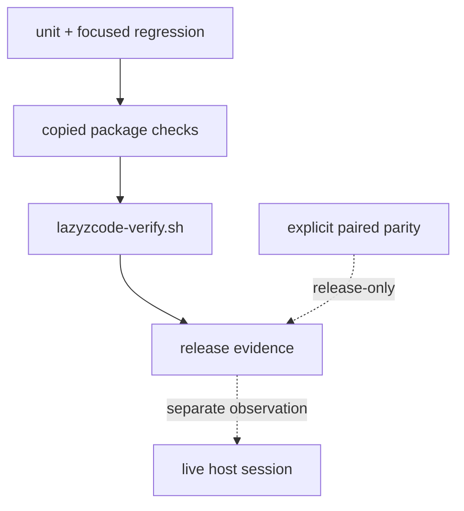

# Test and release verification

LazyZCode uses layered evidence. A release check is useful only when its scope is explicit: a syntax check does not prove a protocol, a protocol fixture does not prove a host connection, and host observation does not rewrite package ownership.

## Read the aggregate result

`scripts/lazyzcode-verify.sh` calls doctor, smoke, documentation, security, MCP, hook-pipeline, load-check, contract, and classified regression checks. It uses `lazyzcode-bounded-run.py` for package-owned checks so the JSON result contains a status and reason instead of a bare exit code. A timeout or failed check is a failure; an unavailable host-side validator is reported as an unchecked condition rather than a fabricated host success.

The verifier's timeout cleanup is **best-effort** process-group cleanup. It is **not a security sandbox** and does not guarantee descendant cleanup. Tests that need to execute untrusted input need a **VM or container-backed runner**.

## Regression families

The `tests/v*.sh` inventory covers copied-package boundaries, manifest and readiness structure, hook inputs, path policy, MCP protocol handling, tooling receipts, provider lifecycle, CodeGraph cleanup, and security regressions such as documentation-MCP SSRF and secret-target handling. Tests construct temporary fixtures so a pass means the package can stand alone rather than relying on the repository's current checkout.

## Release boundary

Normal CI is self-contained: it does not require a sibling repository. Documentation and contract parity with LazyTrae are release-only paired parity checks, run only when both absolute roots are explicitly supplied. That keeps the shared safety contract auditable without creating a runtime, installer, or CI dependency between packages.

Package CI coverage runs on the operating systems and Node versions listed in
the workflows. Plugin discovery, hooks, MCP calls, specialist behavior,
cancellation, and completion require separate manual observation in the
selected current host session. The supplied host observations are historical
macOS reports and do not establish current v1.3.1 readiness.

## How to read a regression by boundary

The shell regressions are intentionally named by the boundary they attack, not
by an implementation detail. For example:

| Regression family | Fixture/action | Failure it prevents |
| --- | --- | --- |
| package/readiness | copied package root and manifest checks | Source checkout assumptions or missing shipped assets. |
| hook/security | structured tool payloads and secret-like paths | Treating arbitrary text as a write target or command authority. |
| MCP params/SSRF | malformed JSON-RPC and attacker-controlled metadata | Stream poisoning or registry metadata becoming a network target. |
| tooling/receipt | empty, linked, modified, and foreign roots | A lifecycle command deleting data it did not create. |
| bounded verifier | timeout and process fixtures | Reporting timeout as success or claiming guaranteed cleanup. |

When a regression fails, start from its fixture and expected assertion, then
follow the smallest source function named in the failure. Do not “fix” a
release check by weakening its assertion: each assertion encodes a published
ownership or evidence contract.

## Manual host-session verification record

Automated CI and package checks do not establish host activation. Current
observation: no current ZCode session has been observed. The supplied macOS
host reports are historical and do not establish v1.3.1 behavior. Keep the
per-host record below pending until observed; do not fill unknown fields from
package files or a previous build.

Before a host session, record the candidate commit or archive SHA and
package-check result. In the selected user-approved host, record host product,
exact version/build, edition or region when shown, OS, selected route, install
root, fresh session ID and start time. Then observe a real Skill/command/hook
appropriate to that route and record the exact invocation and result. Invoke
one named specialist for a bounded task and capture the host-visible action
and actual outputs. Start a bounded delegated task, cancel it through the
host, and record cancellation propagation plus whether any late write
occurred. Complete a small task and inspect the actual changed paths,
task/plan status, and completion artifact; record artifact paths and hashes
alongside the content review. Hashes prove byte integrity only, not
independent truth. For the full-plugin route, record all six expected MCP
connections; for the recovery route, record only the imported Skills and
manual MCP connectors it declares.

| Host | Build/edition | Route and fresh session | Activation and MCP | Specialist | Cancellation | Completion and actual artifacts | Status |
| --- | --- | --- | --- | --- | --- | --- | --- |
| ZCode (Settings → Plugins) | Pending until observed | Pending | Pending | Pending | Pending | Pending | HOST READINESS: PENDING |

If any observation or artifact is absent, retain pending for that field and
for host readiness. Do not infer archive behavior from main CI, or claim host
installation from package/parser validation.

The [outcome-evaluation protocol](../plugins/lazyzcode/contracts/OUTCOME-EVALUATION.md)
defines cost attribution, cohort matching, and artifact-integrity limits for
candidate comparisons.
