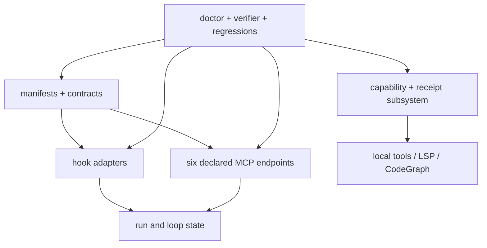

# Runtime subsystem reference

This source-index groups every LazyZCode runtime family by responsibility, including the smaller files that are easy to miss when reading only the main request path.

## Manifest, contract, and readiness layer

`.zcode-plugin/plugin.json` declares the package route; the marketplace entry in `plugins/marketplace.json` lists it for the host. Neither declaration proves host loading. `contracts/automatic-tooling-contract.v1.json` defines providers, fallbacks, permissions, timeouts, and error identifiers. `contracts/lazyseries-capability-readiness.v1.json` defines the canonical capability-readiness records (`lazyzcode_capability_readiness.py readiness-report --json` returns 9 records). Load-check, doctor, and contract checks validate these artifacts from a package root.

## Hook and event layer

`hooks/hooks.json` maps the seven ZCode hook events (`SessionStart`, `UserPromptSubmit`, `PreToolUse`, `PermissionRequest`, `PostToolUse`, `PostToolUseFailure`, `Stop`) to `scripts/hooks/`: session-start, user-prompt-submit, pre-tool-use, post-tool-use, post-tool-use-failure, lifecycle-event, and stop-gate. `pre-tool-use.sh` normalizes supported path fields and checks destructive/secret-target policy. `post-tool-use.sh` can record evidence-oriented consequences. Other hooks recover context or surface workflow status; none prove that a host delivered their event. `hook-pipeline-test.sh` tests controlled structured input.

## Run, loop, and evidence layer

`scripts/state/state-paths.sh` is the shared root/run-ID boundary. Its companion scripts create, load, list, validate, checkpoint, summarize, append events, update tasks/checkboxes, and recover runs. `scripts/loop/` classifies failure, creates repair tasks, selects work, runs a cycle, and finalizes a run. This is file-backed workflow state, not a database and not host session state.

## MCP and local analysis layer

The six declared servers — `run-ledger`, `verification`, `status-dashboard`, `context-graph`, `code-intel`, and `docs` — expose constrained views or operations; `mcp/profile-gate.sh` applies the `LAZYZCODE_MCP_MODE` profile gate (`direct`, `assisted`, `planned`, `orchestrated`, `long-horizon`; empty defers). The run-ledger, verification, and dashboard servers expose constrained state views. `mcp/jsonrpc.py` is the line protocol loop; `mcp/path_boundary.py` canonicalizes repository-local paths. `context-graph` uses `rg`/`grep` heuristics. `code-intel` is a local code-oriented bridge. The optional `mcp/lsp/` and `mcp/codegraph/` programs are not declared in `.mcp.json`; the receipt-owned tooling lifecycle (`lazyzcode-tooling.sh`) launches them explicitly, and `mcp/lsp/session.py` manages LSP session protocol while operations remain read-only. `docs` only queries fixed package registries.

## Tooling and process layer

`lazyzcode-tooling.sh` owns provider status, install, doctor, uninstall, native-check discovery, LSP, CodeGraph, and optional remote export. Python helpers split capability execution, contract validation, process invocation, readiness records, receipts, detection, and policy/configuration. `lazyzcode-bounded-run.py` reports timeouts and best-effort owned process-group cleanup for trusted checks.

## Verification layer

Smoke, security, MCP, hook-pipeline, doctor, load-check, contract, and documentation scripts each verify one boundary. `lazyzcode-verify.sh` aggregates them and classifies every `tests/v*.sh` regression. Paired docs parity is release-only with explicit sibling roots; normal verification remains self-contained.

Use [Package map](../07-package-map.md), [MCP inventory](mcp-inventory.md), and [Dependency and host boundary reference](dependency-and-host-boundaries.md) to continue the trace.
